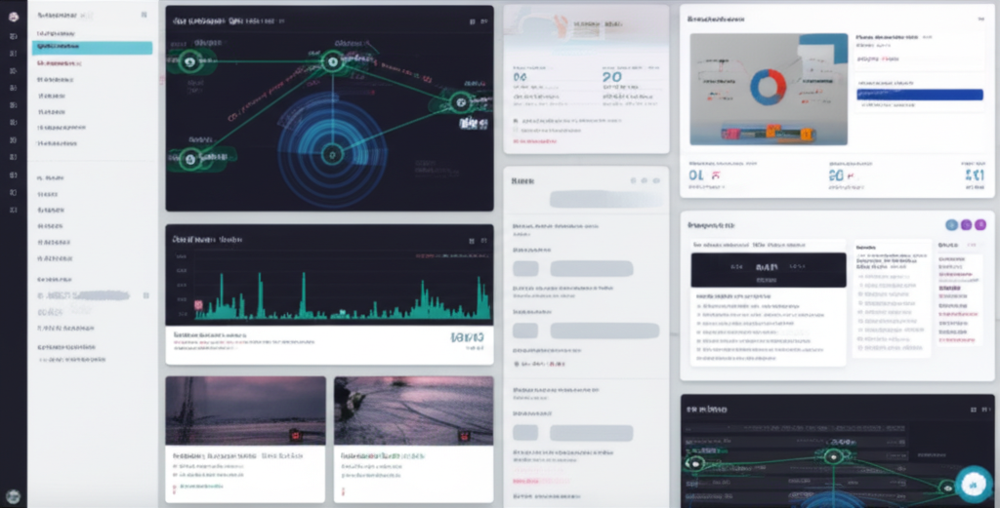
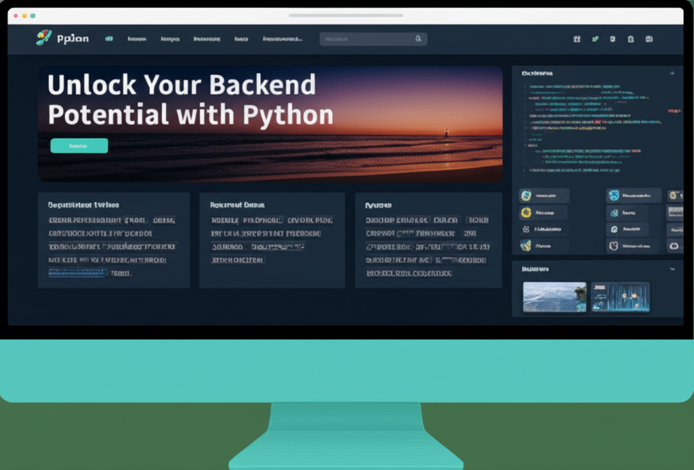
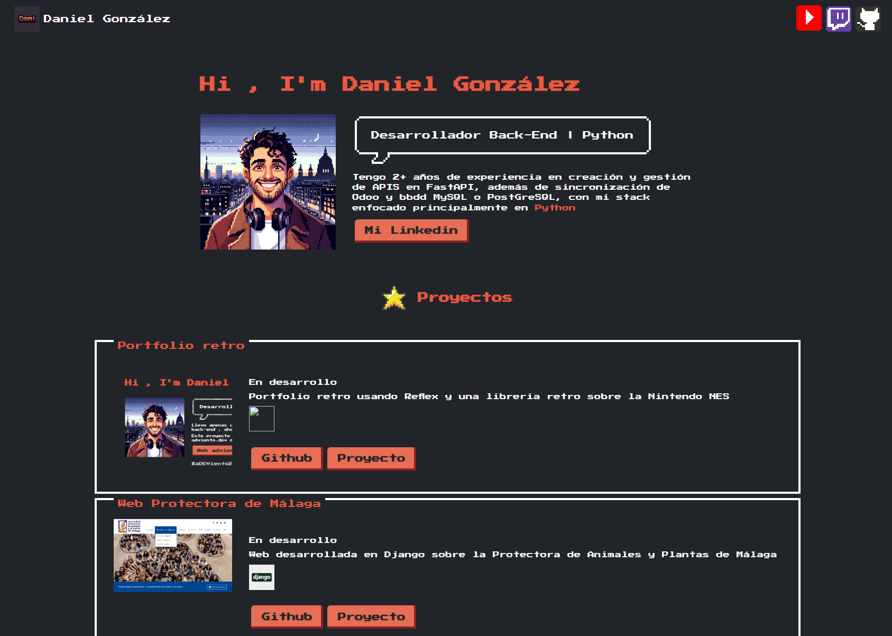
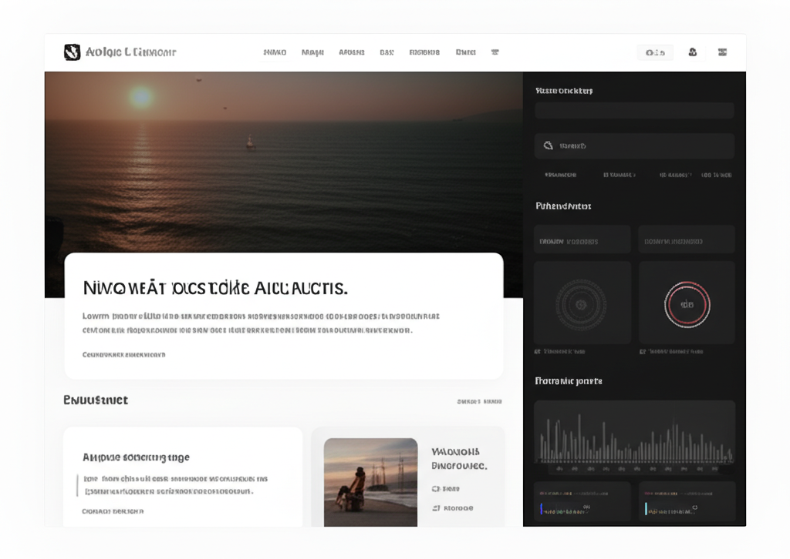

# 🚀 Daniel's Interactive Portfolio OS

[](https://opensource.org/licenses/MIT)
[](https://nextjs.org/)
[](https://www.typescriptlang.org/)
[](https://tailwindcss.com/)

Un portfolio personal e interactivo con la apariencia de un sistema operativo, diseñado para mostrar mis habilidades y proyectos de una manera única y atractiva.

## ✨ Live Demo

[¡Explora mi portfolio interactivo aquí!](https://daniel-portfolio-os.vercel.app/) (Enlace de demostración)

## 📸 Screenshots

| Escritorio Principal | Aplicación tipo Postman |
| :---: | :---: |
|  |  |
| **Terminal Interactiva** | **Blog Técnico** |
|  |  |

## 🌟 Características

- **🖥️ Interfaz de Sistema Operativo:** Una experiencia de escritorio completa con iconos, barra de tareas y ventanas.
- **👨‍💻 Aplicación tipo Postman:** Explora las secciones de mi portfolio (Sobre mí, Experiencia, Proyectos) como si estuvieras usando una API.
- **⌨️ Terminal Interactiva:** Ejecuta comandos para obtener información, controlar el sistema y más.
- **🎨 Temas Personalizables:** Cambia la apariencia del sistema operativo con diferentes temas (Matrix, VSCode, etc.).
- **🚀 Animación de Arranque:** Una animación de arranque inmersiva para simular el inicio del sistema.
- **💼 Modo de Presentación:** Un modo especial para presentar tus proyectos de forma profesional.
- **📱 PWA (Progressive Web App):** Instala el portfolio en tu dispositivo para un acceso rápido y sin conexión.
- **🌐 Multi-idioma:** Soporte para múltiples idiomas (actualmente Español e Inglés).

## 🛠️ Tech Stack

- **Framework:** [Next.js](https://nextjs.org/)
- **Lenguaje:** [TypeScript](https://www.typescriptlang.org/)
- **Estilos:** [Tailwind CSS](https://tailwindcss.com/)
- **Animaciones:** [Framer Motion](https://www.framer.com/motion/) (implícito en las transiciones)
- **Iconos:** [Lucide React](https://lucide.dev/)
- **Componentes:** [shadcn/ui](https://ui.shadcn.com/)

## 🚀 Cómo Empezar

Sigue estos pasos para configurar y ejecutar el proyecto en tu entorno local.

### Prerrequisitos

- [Node.js](https://nodejs.org/en/) (v18.x o superior)
- [pnpm](https://pnpm.io/)

### Instalación

1.  **Clona el repositorio:**

    ```bash
    git clone https://github.com/tu-usuario/tu-repositorio.git
    cd tu-repositorio
    ```

2.  **Instala las dependencias:**

    ```bash
    pnpm install
    ```

3.  **Ejecuta el servidor de desarrollo:**

    ```bash
    pnpm run dev
    ```

4.  **Abre tu navegador:**

    Visita [`http://localhost:3000`](http://localhost:3000) para ver la aplicación en acción.

## 🕹️ Uso

### Comandos de la Terminal

La terminal interactiva soporta los siguientes comandos:

| Comando | Descripción |
| :--- | :--- |
| `help` | Muestra una lista de todos los comandos disponibles. |
| `about` | Muestra información sobre mí. |
| `skills` | Enumera mis habilidades técnicas. |
| `experience` | Detalla mi experiencia laboral. |
| `projects` | Muestra una lista de mis proyectos. |
| `education` | Describe mi formación académica. |
| `contact` | Proporciona mi información de contacto. |
| `git status` | Muestra el estado del repositorio (simulado). |
| `python --version` | Muestra la versión de Python (simulada). |
| `docker ps` | Muestra los contenedores de Docker activos (simulado). |
| `clear` | Limpia el historial de la terminal. |
| `whoami` | Muestra el usuario actual. |
| `reboot` | Reinicia el sistema operativo del portfolio. |
| `suspend` | Suspende la sesión. |
| `shutdown` | Apaga el sistema operativo del portfolio. |

## 📦 Despliegue

Este proyecto está configurado para un despliegue sencillo en [Vercel](https://vercel.com/), la plataforma de los creadores de Next.js.

1.  **Haz un fork del repositorio** a tu propia cuenta de GitHub.
2.  **Conecta tu repositorio a Vercel.**
3.  **Configura las variables de entorno** si es necesario.
4.  **¡Despliega!** Vercel se encargará del resto.

## 🤝 Contribuciones

Las contribuciones son bienvenidas. Si tienes alguna idea para mejorar el proyecto, por favor abre un *issue* para discutirlo o envía un *pull request*.

1.  Haz un *fork* del proyecto.
2.  Crea tu rama de funcionalidad (`git checkout -b feature/AmazingFeature`).
3.  Haz *commit* de tus cambios (`git commit -m 'Add some AmazingFeature'`).
4.  Haz *push* a la rama (`git push origin feature/AmazingFeature`).
5.  Abre un *Pull Request*.

## 📄 Licencia

Distribuido bajo la Licencia MIT. Ver `LICENSE` para más información.

## 📬 Contacto

Daniel González Pascual - [@danielgonzalezpascual](https://www.linkedin.com/in/daniel-gonzalez-pascual/)

Enlace del Proyecto: [https://github.com/tu-usuario/tu-repositorio](https://github.com/tu-usuario/tu-repositorio)
